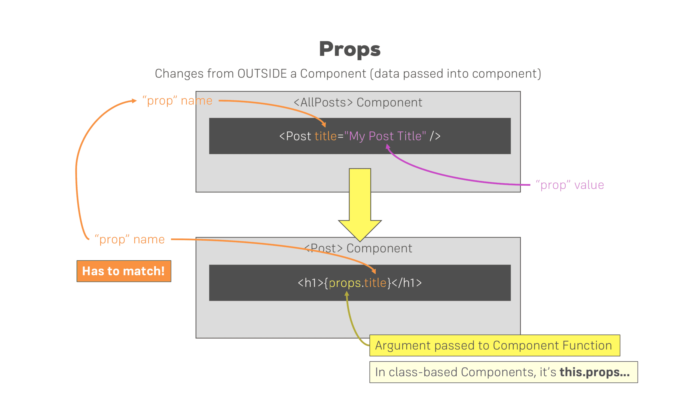
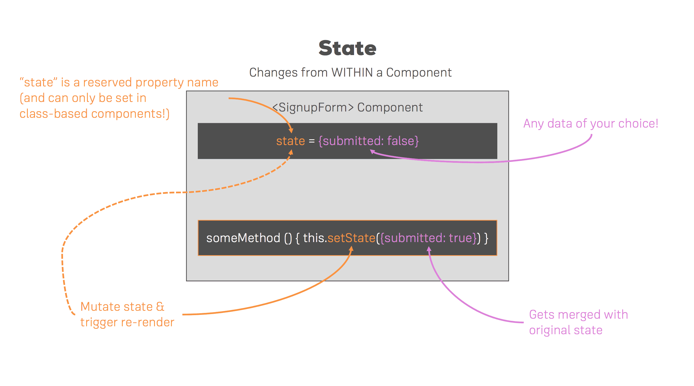

# My First React App
## Introduction
In this section, we worked on our first React app. Below I have included some useful links to the 
official documentation.

- create-react-app: https://github.com/facebookincubator/create-react-app
- Introducing JSX: https://reactjs.org/docs/introducing-jsx.html
- Rendering Elements: https://reactjs.org/docs/rendering-elements.html
- Components & Props: https://reactjs.org/docs/components-and-props.html
- Listenable Events: https://reactjs.org/docs/events.html

## Build Workflow
When developing our react apps, whether it be a SPA (Single-Page App) or a MPA (Multi-Page App), we want to develop in a local environment. It is recommended to utilize a build workflow for the following reasons:
1. **Optimize our code**  
    We want to ensure that our code is as small as possible and as optimized as possible to improve the performance of our app.
1. **Use Next-Gen JS features**  
    This makes our life a lot easier because the code is leaner, easier to read, faster and less error prone.  This is a best-practice in react.
1. **Be more Productive**
    No need to figure out all dependencies, converting code for browser compatibility, spin up servers to test and troubleshoot, etc...

In order to achieve this we need the following tools:
1. **Dependency Management**
    These are third party libraries that makes it easier to get all the dependencies of any packages or libraries we would need to use in our apps. The two popular options are npm or yarn and in this course, we will use _npm_.
1. **Bundler**
    This allows us to write clean, modular code and splitting it up over multiple files, so that each file has a clear task and therefore is easier to manage.  But then we want all these files to be bundled into just a couple of files in the end, so that the browser does not need to make hundreds or even thousands of requests.  In this course, we will use _Webpack_ which is the de-facto standard for bundling these days.
1. **Compiler**
    Because many browsers do not support the latest JS features, we will use a compiler to translate the JS to use work-arounds that work on older browsers.  We will use _Babel_ and some presets in this course.
1. **Development Server**
    We need a development web server to test our app on our local machine. If we were to simply double click an HTML file, this would use the file protocol vs the http protocol, which would not correctly emulate the app running as it runs on a web server.

This may seem like a lot of requirements to even get started, however this is all very easy to setup using a tool which we will discuss in the next section.

## Creating Our React App
In order to create our first React App, we first install node from the official [nodejs website](https://nodejs.org/en/). 
After that, we simply run the following command:
```
npx create-react-app <project>
```
<p align='center'>

</p>

## React Folder Structure
```
|-> my-app
    |-> node modules
    |-> public
    |-> src
    > .gitignore
    > package-lock.json
    > package.json
    > README.md
```
- The lock files `package-lock.json` and yarn.lock are basically locking in the versions of the dependencies we are using.
- The general depencies our projects has is defined in the `package.json` file. There are also a few scripts defined in here that we can run by using _npm run [script name]_. The _"start"_ command can be used to run the development server, compile our code, watch our code, etc... When we are ready to deploy our app we can use the _"build"_ command which will prepare the app for deployment, but not run the development server.
- The `node-modules` holds all the dependencies, sub-dependencies, and build tools of our project. We should not touch anything in here as it is created and maintained automatically. Also, it is ignored by git to save space as this folder gets very large, very quickly.
- The `public` folder is basically the root folder that gets served by the webserver. For many SPA's, and in this project, we will never add more html files to this folder. The manifest.json file is there, is used for progressive web apps where we define metadata for our app.
- The `src` folder is where we will actually be working in, it is our react application.  The index.js file gets access to the root element in our index.html file in the public folder.

## VSCode (Emmet)
To get emmet (code completion) working in VSCode, simply add this to your user settings:
```
"emmet.includeLanguages": {
        "javascript": "javascriptreact"
    },
    "emmet.triggerExpansionOnTab": true
```

## Components
Components are the core building blocks of React apps. Actually, React
really is just a library for creating components at its core.
A typical React app therefore could be depicted as a component tree -
having one root component ("App") and then a potentially infinite amount
of nested child components. Each component needs to return/render some JSX code - it defines
which HTML code React should render to the real DOM in the end.

**JSX is NOT HTML** but it looks a lot like it. Differences can be seen when
looking closely though (for example className in JSX vs class in "normal
HTML"). JSX is just syntactic sugar for JavaScript, allowing you to write
HTMLish code instead of nested React.createElement(...) calls.
When creating components, you have the choice between two different
ways:

1. **Functional Components** (also referred to as "presentational", "dumb" or
"stateless" components - more about this later in the course):
```javascript
// using ES6 arrow functions as shown here is recommended but optional
const cmp = () => { 
    return <div>some JSX</div> 
}
```
2. **Class-based Components** (also referred to as "containers", "smart" or "stateful"
components): 
```javascript
class Cmp extends Component { 
    render () {
        return <div>some JSX</div> 
    } 
}
```

We'll of course dive into the difference throughout this course, you can
already note that you should use 1) as often as possible though. It's the
best-practice.

## Props

`props` allow you to pass data from a parent (wrapping) component to a child (embedded) component. `props` and 
`state` are CORE concepts of React. In fact, only changes in `props` and/or `state` trigger React to rerender 
your components and potentially update the DOM in the browser.

#### Example:
```javascript
// AllPosts Component:
const posts = () => {
    return (
        <div>
            <Post title="My first Post" />
        </div>
    );
}
```

Here, title is the custom property (`prop`) set up on the custom Post component. We basically replicate 
the default HTML attribute behavior we already know (e.g. `<input type="text">` informs the browser about
how to handle that input).

```javascript
// Post Component:
const post = (props) => {
    return (
        <div>
            <h1>{props.title}</h1>
        </div>
    );
}
```

The Post component receives the props argument. You can of course name this argument whatever you want - 
it's your function definition, React doesn't care! But React will pass one argument to your component 
function => An object, which contains all properties you set up on `<Post ... />` . `{props.title}` then 
dynamically outputs the title property of the props object - which is available since we set the title 
property inside AllPosts component.




## State

Whilst props allow you to pass data down the component tree (and hence trigger an UI update), state is used 
to change the component, well, state from within. Changes to state also trigger an UI update.

#### Example:
```javascript
// NewPost Component:
class NewPost extends Component { // state can only be accessed in class-based components!
    state = {
        counter: 1
    };  
 
    render () { // Needs to be implemented in class-based components! Needs to return some JSX!
        return (
            <div>{this.state.counter}</div>
        );
    }
}
```
Here, the `NewPost` component contains state . Only class-based components can define and use state . You can 
of course pass the state down to functional components, but these then can't directly edit it.

`state` simply is a property of the component class, you have to call it state though - the name is not optional. 
You can then access it via `this.state` in your class JSX code (which you return in the required `render()` method).

Whenever state changes (taught over the next lectures), the component will re-render and reflect the new state. 
The difference to props is, that this happens within one and the same component - you don't receive new data 
(`props`) from outside!



## Events
We saw that you can react to the onClick event - but to which other events can you listen? You can find a list of 
supported events here: https://reactjs.org/docs/events.html#supported-events
