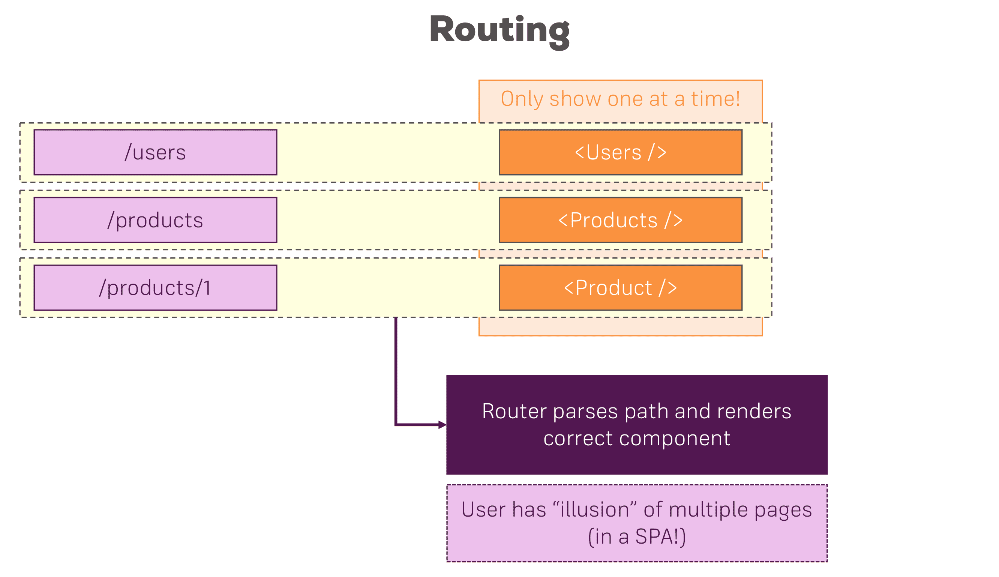

# My First React App
## Introduction
In this section, we worked on our first React app. Below I have included some useful links to the 
official documentation.

- create-react-app: https://github.com/facebookincubator/create-react-app
- Introducing JSX: https://reactjs.org/docs/introducing-jsx.html
- Rendering Elements: https://reactjs.org/docs/rendering-elements.html
- Components & Props: https://reactjs.org/docs/components-and-props.html
- Listenable Events: https://reactjs.org/docs/events.html

## Build Workflow
When developing our react apps, whether it be a SPA (Single-Page App) or a MPA (Multi-Page App), we want to develop in a local environment. It is recommended to utilize a build workflow for the following reasons:
1. **Optimize our code**  
    We want to ensure that our code is as small as possible and as optimized as possible to improve the performance of our app.
1. **Use Next-Gen JS features**  
    This makes our life a lot easier because the code is leaner, easier to read, faster and less error prone.  This is a best-practice in react.
1. **Be more Productive**
    No need to figure out all dependencies, converting code for browser compatibility, spin up servers to test and troubleshoot, etc...

In order to achieve this we need the following tools:
1. **Dependency Management**
    These are third party libraries that makes it easier to get all the dependencies of any packages or libraries we would need to use in our apps. The two popular options are npm or yarn and in this course, we will use _npm_.
1. **Bundler**
    This allows us to write clean, modular code and splitting it up over multiple files, so that each file has a clear task and therefore is easier to manage.  But then we want all these files to be bundled into just a couple of files in the end, so that the browser does not need to make hundreds or even thousands of requests.  In this course, we will use _Webpack_ which is the de-facto standard for bundling these days.
1. **Compiler**
    Because many browsers do not support the latest JS features, we will use a compiler to translate the JS to use work-arounds that work on older browsers.  We will use _Babel_ and some presets in this course.
1. **Development Server**
    We need a development web server to test our app on our local machine. If we were to simply double click an HTML file, this would use the file protocol vs the http protocol, which would not correctly emulate the app running as it runs on a web server.

This may seem like a lot of requirements to even get started, however this is all very easy to setup using a tool which we will discuss in the next section.

## Creating Our React App
In order to create our first React App, we first install node from the official [nodejs website](https://nodejs.org/en/). 
After that, we simply run the following command:
```
npx create-react-app <project>
```
<p align='center'>

</p>

## React Folder Structure
```
|-> my-app
    |-> node modules
    |-> public
    |-> src
    > .gitignore
    > package-lock.json
    > package.json
    > README.md
```
- The lock files `package-lock.json` and yarn.lock are basically locking in the versions of the dependencies we are using.
- The general depencies our projects has is defined in the `package.json` file. There are also a few scripts defined in here that we can run by using _npm run [script name]_. The _"start"_ command can be used to run the development server, compile our code, watch our code, etc... When we are ready to deploy our app we can use the _"build"_ command which will prepare the app for deployment, but not run the development server.
- The `node-modules` holds all the dependencies, sub-dependencies, and build tools of our project. We should not touch anything in here as it is created and maintained automatically. Also, it is ignored by git to save space as this folder gets very large, very quickly.
- The `public` folder is basically the root folder that gets served by the webserver. For many SPA's, and in this project, we will never add more html files to this folder. The manifest.json file is there, is used for progressive web apps where we define metadata for our app.
- The `src` folder is where we will actually be working in, it is our react application.  The index.js file gets access to the root element in our index.html file in the public folder.

## VSCode (Emmet)
To get emmet (code completion) working in VSCode, simply add this to your user settings:
```
"emmet.includeLanguages": {
        "javascript": "javascriptreact"
    },
    "emmet.triggerExpansionOnTab": true
```

## JSX Basic Example
```jsx
return (
      <div className="App">
        <h1>This is my first React App!</h1>
        <p>This is really working!</p>
      </div>
    );
```
***Note:** JSX looks a lot like HTML, but did you notice that _"className"_ is used instead of _"class"_. There are many subtle differences like this in JSX and that is because it is actually just javascript, NOT HTML. In Javascript, _class_ is a reserved word, which is why we have to use _className_. It's also a best practice to wrap all your jsx in a single div, like we did in the example above. If we wanted to, we can instead write our code like shown below. In fact, our code will be compiled by one of the many build tools to be like the code below, but it is cumbersome to write our code like that, so we use JSX as shown above instead.
```jsx
return React.createElement('div', null, React.createElement('h1', {className: 'App'}, 'This is my first React App!'));
```
> This is the exact same thing as the JSX example. In fact, the JSX will eventually be compiled by one of the many build tools to look just like this example here.

## Components
Components are the core building blocks of React apps. Actually, React
really is just a library for creating components at its core.
A typical React app therefore could be depicted as a component tree -
having one root component ("App") and then a potentially infinite amount
of nested child components. Each component needs to return/render some JSX code - it defines
which HTML code React should render to the real DOM in the end.

**JSX is NOT HTML** but it looks a lot like it. Differences can be seen when
looking closely though (for example className in JSX vs class in "normal
HTML"). JSX is just syntactic sugar for JavaScript, allowing you to write
HTMLish code instead of nested React.createElement(...) calls.
When creating components, you have the choice between two different
ways:

1. **Functional Components** (also referred to as "presentational", "dumb" or
"stateless" components - more about this later in the course):
```javascript
// using ES6 arrow functions as shown here is recommended but optional
const cmp = () => { 
    return <div>some JSX</div> 
}
```
2. **Class-based Components** (also referred to as "containers", "smart" or "stateful"
components): 
```javascript
class Cmp extends Component { 
    render () {
        return <div>some JSX</div> 
    } 
}
```

We'll of course dive into the difference throughout this course, you can
already note that you should **_use functional components as often as possible_** though. It's the
best-practice and it's better because they do NOT handle state management, making it easier to debug your app.

## Props

`props` allow you to pass data from a parent (wrapping) component to a child (embedded) component. `props` and 
`state` are CORE concepts of React. In fact, only changes in `props` and/or `state` trigger React to rerender 
your components and potentially update the DOM in the browser.

#### Example:
```javascript
// AllPosts Component:
const posts = () => {
    return (
        <div>
            <Post title="My first Post" />
        </div>
    );
}
```

Here, title is the custom property (`prop`) set up on the custom Post component. We basically replicate 
the default HTML attribute behavior we already know (e.g. `<input type="text">` informs the browser about
how to handle that input).

```javascript
// Post Component:
const post = (props) => {
    return (
        <div>
            <h1>{props.title}</h1>
        </div>
    );
}
```

The Post component receives the props argument. You can of course name this argument whatever you want - 
it's your function definition, React doesn't care! But React will pass one argument to your component 
function => An object, which contains all properties you set up on `<Post ... />` . `{props.title}` then 
dynamically outputs the title property of the props object - which is available since we set the title 
property inside AllPosts component.


## State

Whilst props allow you to pass data down the component tree (and hence trigger an UI update), state is used 
to change the component, well, state from within. Changes to state also trigger an UI update.

#### Example:
```javascript
// NewPost Component:
class NewPost extends Component { // state can only be accessed in class-based components!
    state = {
        counter: 1
    };  
 
    render () { // Needs to be implemented in class-based components! Needs to return some JSX!
        return (
            <div>{this.state.counter}</div>
        );
    }
}
```
Here, the `NewPost` component contains state . Only class-based components can define and use state . You can 
of course pass the state down to functional components, but these then can't directly edit it.

`state` simply is a property of the component class, you have to call it state though - the name is not optional. 
You can then access it via `this.state` in your class JSX code (which you return in the required `render()` method).

Whenever state changes (taught over the next lectures), the component will re-render and reflect the new state. 
The difference to props is, that this happens within one and the same component - you don't receive new data 
(`props`) from outside!


## Events
We saw that you can react to the onClick event - but to which other events can you listen? You can find a list of 
supported events here: https://reactjs.org/docs/events.html#supported-events

## Conditional Content
Since JSX is really javascript and NOT HTML, we can use ternary to conditionally output things as shown below.  Only simple javascript statements can be used, so if/else blocks are not allowed, which is why we used ternary here. 
```javascript
return (
      <div className="App">
        <h1>This is my first React App!</h1>
        <p>This is really working!</p>
        <button
          style={style} 
          onClick={this.togglePersonsHandler} >Switch Name</button>
        { 
          this.state.showPersons ? 
          <div>
            <Person 
              name={this.state.persons[0].name}
              age={this.state.persons[0].age}
              />
            <Person 
              name={this.state.persons[1].name} 
              age={this.state.persons[1].age} />
          </div> : null
        }
      </div>
    );
```
However, if we pull out the content from the return statement, we have more control.  This is the preferred way of handling conditional content.
```javascript
let persons = null;
if (this.state.showPersons) {
    persons = (
    <div>
        <Person 
            name={this.state.persons[0].name}
            age={this.state.persons[0].age}
            />
        <Person 
            name={this.state.persons[1].name} 
            age={this.state.persons[1].age} />
    </div>
    );
}

return (
    <div className="App">
    <h1>This is my first React App!</h1>
    <p>This is really working!</p>
    <button
        style={style} 
        onClick={this.togglePersonsHandler} >Switch Name</button>
    {persons}
    </div>
);
```

## Outputting Lists
Our previous way of presenting a list was very inefficient:
```javascript
persons = (
    <div>
        <Person 
            name={this.state.persons[0].name}
            age={this.state.persons[0].age} />
        <Person 
            name={this.state.persons[1].name} 
            age={this.state.persons[1].age} />
        <Person 
            name={this.state.persons[2].name} 
            age={this.state.persons[2].age} />
        <Person 
            name={this.state.persons[3].name} 
            age={this.state.persons[3].age} />
        <Person 
            name={this.state.persons[4].name} 
            age={this.state.persons[4].age} />
    </div>
);
```
This is a better way:
```javascript
persons = (
    <div>
        {this.state.persons.map(person => {
            return <Person name={person.name} age={person.age} />
        })}
    </div>
```

## Update State Immutably
```javascript
deletePersonHandler = (personIndex) => {
    const persons = this.state.persons;
    persons.splice(personIndex, 1);
    this.setState({persons: persons})
  }
```
The flaw of this approach is that in javascript, objects and arrays are reference types. So when we get persons from the state, we are actually getting a pointer to the original state. By splicing the pointer, you are affecting the actual data, which is NOT a good practice. No errors will be thrown, but it can result in wonky, unexpected behaviors.
```javascript
deletePersonHandler = (personIndex) => {
    const persons = this.state.persons.slice();
    persons.splice(personIndex, 1);
    this.setState({persons: persons})
  }
```
One alternative is to call splice() to make a copy of the state and then splice that copy. In this way, we are making immutable changes to the persons array.
```javascript
deletePersonHandler = (personIndex) => {
    const persons = [...this.state.persons];
    persons.splice(personIndex, 1);
    this.setState({persons: persons})
  }
```
We can also use the spread operator to achieve the same.
> Always make changes to state immutably

## Key prop
The key property, is an important property in we should add when rendering a list of data.  It is a default property react expects to find on an element that you render through a list and it helps react update the list efficiently. The key is used by react to keep track of the individual elements so that it has a clear property it can compare to find out which elements changed, so that it only re-renders those elements, and not the ones that did not change.

**Before:**
```javascript
state = {
    persons: [
        {name: 'Linh', age: 25},
        {name: 'Mark', age: 22},
        {name: 'Edouard', age: 19}
    ],
    showPersons: false
}

persons = (
    <div>
        {this.state.persons.map((person, index) => {
        return <Person 
            click={this.deletePersonHandler.bind(this, index)}
            name={person.name}
            age={person.age} />
        })}
    </div>
);
```
**After:**
```javascript
state = {
    persons: [
        { id: 1, name: 'Linh', age: 25},
        { id: 2, name: 'Mark', age: 22},
        { id: 3, name: 'Edouard', age: 19}
    ],
    showPersons: false
}

persons = (
    <div>
        {this.state.persons.map((person, index) => {
        return <Person 
            click={this.deletePersonHandler.bind(this, index)}
            name={person.name}
            age={person.age}
            key={person.id} />
        })}
    </div>
);
```
*We do NOT use the map index because if that gets reset on every map call.  For example, if we delete index 3, then the indexes over three will cascade down.

## Styles (Inline Styles vs Separate CSS file)
You can set your styles using css files or defining them in the javascript code.  When using them as separate files, know that they will be globally scoped, but if put in the javascript, they are scoped only at the component level.  Below are some examples of styles written in the javascript code:
```javascript
 render() {
    const style = {
      backgroundColor: 'green',
      color: 'white',
      font: 'inherit',
      border: '1px solid blue',
      padding: '8px',
      cursor: 'pointer'
    };

    return (
      <div>
        <h1>This is my first React App!</h1>
        <button
          style={style} 
          onClick={this.togglePersonsHandler} >Toggle Persons</button>
        {persons}
      </div>
    );
 }
```
When defining the styles, notice that they are not exact css syntax. For example, 'background-color' is written as 'backgroundColor'. This is because the naming convention still has to be proper javascript. If you wanted to use the proper css syntax, you can simply use quotes and it will still work.

```javascript
 render() {
    const classes = [];
    if (this.state.persons.length <= 2) {
      classes.push('red');
    }
    if (this.state.persons.length <= 1) {
      classes.push('bold');
    }

    return (
      <div className='App'>
        <h1>This is my first React App!</h1>
        <p className={classes.join(' ')}>This is really working!</p>
        {persons}
      </div>
    );
 }
```
We can still have dynamic styles when using separate CSS files as shown above. The course goes into a lot of details on using packages like Radium to use inline styles, but I prefer this method, and it is the one I will be sticking with.

There are also packages for improving how styling works in React.  Below are links to some resources
- Using CSS Modules in create-react-app Projects: https://medium.com/nulogy/how-to-use-css-modules-with-create-react-app-9e44bec2b5c2

- More information about CSS Modules: https://github.com/css-modules/css-modules

## Debugging
Debugging react is pretty similar to debugging any web app.  First and most importantly, learn to enjoy error messages, do NOT fear them.  Check the Chrome Developer Tools and read any error messages you may encounter.  Secondly, install the 'React Developer Tools' chrome extension to get additional information when debugging your react apps.  Last but not least, you can create a ErrorBoundary HOC (Higher Order Component), that you wrap your components with.  Any time an error is thrown, your HOC will redirect to a custom error message.  Do NOT overly rely on this, as it is better to actually fix your code, rather than simply catch any errors.  Below are some resource links for more information:

- Error Boundaries: https://reactjs.org/docs/error-boundaries.html
- Chrome Devtool Debugging: https://developers.google.com/web/tools/chrome-devtools/javascript/

## Folder Structure
In the training, Max had us restructure the src folder to follow a cleaner setup, that I like as well:
```
|-> src
    |-> assets
    |-> components
    |-> containers
```
In the `assets` folder we can place any images or media files, the `components` folder will contain our 'stateless', 'presentational', functional, components that format the view (like the Person component) and lastly the `containers` folder will hold the 'stateful', 'container', class components that store and manipulate state (like the App component).

## Aux and Fragment
A common pattern in React is for a component to return a lsit of children. Take this example:
```javascript
class Table extends React.Component {
  render() {
    return (
      <table>
        <tr>
          <Columns />
        </tr>
      </table>
    );
  }
}
```
`<Columns />` would need to return multiple `<td>` elements in order for the rendered HTML to be valid. However, React requires a single element at a time, so you would need to wrap all the elements with a div for example. But, if a parent div was used inside the `render()` of `<Columns />`, then the resulting HTML will be invalid.

```javascript
class Columns extends React.Component {
  render() {
    return (
      <div>
        <td>Hello</td>
        <td>World</td>
      </div>
    );
  }
}
```
The above will result in the following invalid HTML:
```html
<table>
  <tr>
    <div>
      <td>Hello</td>
      <td>World</td>
    </div>
  </tr>
</table>
```
So to fix that, we can use `fragments`:
```javascript
class Columns extends React.Component {
  render() {
    return (
      <React.Fragment>
        <td>Hello</td>
        <td>World</td>
      </React.Fragment>
    );
  }
}
```
Which results in the following HTML:
```html
<table>
  <tr>
    <td>Hello</td>
    <td>World</td>
  </tr>
</table>
```

Reference:  
https://reactjs.org/docs/fragments.html

## Ajax / Axios
In order to get data from a server to use in our frontend application, we can use AJAX.  AJAX allows us to make http requests in the backend, almost invisible to the user, which allows a faster and more fluid user experience.  In this course, we are using `axios`, which is a Promise based HTTP client written in javascript. Below is the documentation for axios, which is pretty much what we went over in this section.

Reference:  
https://github.com/axios/axios

## Routing
```
npm install --save react-router-dom
```
We installed both `react-router`  and `react-router-dom`. Technically, only `react-router-dom`  is required for web development. It wraps `react-router`  and therefore uses it as a dependency.  We don't need to install `react-router` on our own for it to work. You can omit this installation step, I left it in there for historic reasons and because I like to emphasize that the main package is named `react-router`. If you ever search online for assistance, you probably want to search for "react router". 


